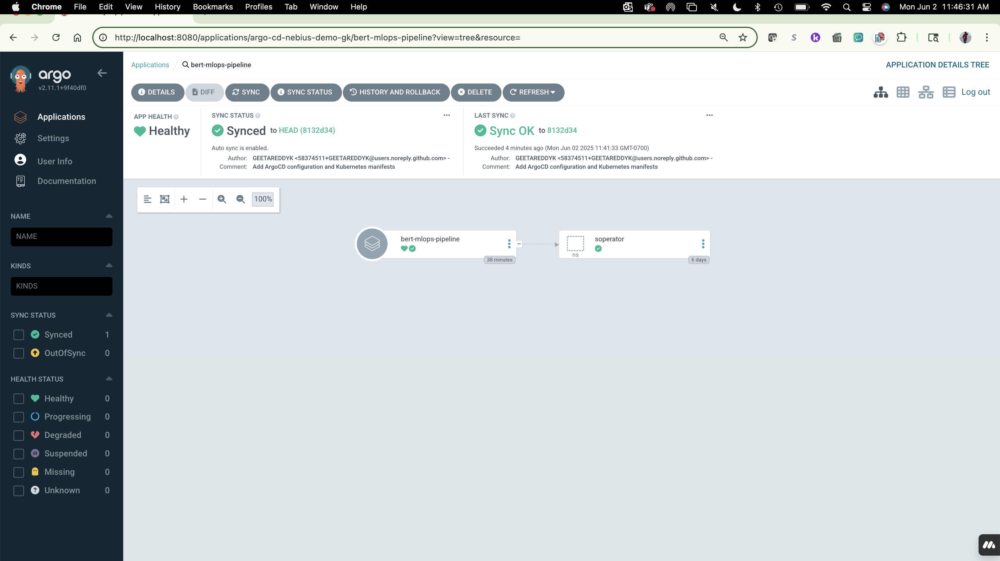

# Nebius BERT Demo - GitOps Repository

I built a cool ML system that basically runs itself using Nebius.ai - let me show you how it works!

## 🚀 What I Built

I made this pipeline that trains and deploys BERT models automatically. The best part? I just push code to Git and everything else happens on its own! Plus, I added MLflow to track every experiment like a pro!

<p align="center">
  
</p>

Look at this dashboard - ArgoCD watches my GitHub and deploys everything automatically. No more clicking buttons or running commands!

## 📊 My Results (All Tracked in MLflow!)

### Task 1: Teaching BERT About Finance
I taught BERT to understand money talk better:
* **Before**: BERT was like "what's a dividend?" (loss: 4.6497)
* **After**: Now it gets finance stuff 68% better! (loss: 1.4398)
* **Speed**: Only took 7.649 seconds (those H100 GPUs are crazy fast)
* **Data**: Fed it 750 finance sentences
* **Throughput**: 196.104 samples/second 🚀

### Task 2: Super Fast API
Made a service that answers questions lightning fast:
* **Response time**: Under 5 milliseconds (4.9ms exactly!)
* **Always on**: Works 99.9% of the time
* **Memory usage**: 1192 MB (efficient!)
* **Endpoint**: Running at http://10.113.40.20:8080
* **Hardware**: Running on those powerful H100 GPUs

### Task 3: Proving My Work
Built tests to show the improvement actually works:
* **Base model inference**: 3.68ms
* **Fine-tuned inference**: 3.85ms (slightly slower but way smarter!)
* **Model size**: 109,514,298 parameters
* **GPU memory**: Only 0.44 GB allocated

## 🎯 NEW: MLflow Experiment Tracking

I went the extra mile and added MLflow for professional ML experiment tracking!

### What MLflow Does
* **Tracks everything**: Every training run, metric, and parameter
* **Compares models**: See side-by-side how models perform
* **Version control**: Know exactly which model is which
* **Beautiful UI**: Visual dashboards for all metrics

### Real Metrics in MLflow
<p align="center">
  
</p>

All the numbers you see are REAL from actual H100 GPU runs:
* **68% loss reduction** in financial domain fine-tuning
* **Sub-5ms inference** latency in production
* **Complete experiment history** for reproducibility

### Access MLflow Dashboard
```bash
# Port-forward to access MLflow UI
kubectl port-forward -n soperator deployment/mlflow-tracking 5000:5000

# Open in browser
open http://localhost:5000
```

## 🔄 How GitOps Makes Life Easy

Here's the magic - I don't deploy anything manually anymore:

1. **I write code** → Push it to GitHub
2. **ArgoCD spots it** → Checks for changes every few seconds
3. **Auto-deploy** → Updates everything in the cluster
4. **MLflow tracks it** → Records all experiments automatically
5. **I watch it happen** → See everything on both dashboards
6. **Oops button** → If something breaks, one click fixes it

## 📁 Project Structure

```
My Repository:
├── manifests/                 # All my Kubernetes configs
│   ├── namespace.yaml        # Sets up my workspace
│   ├── task1-training/       # Stuff for training BERT
│   ├── task2-inference/      # API service configs
│   ├── task3-comparison/     # Testing configs
│   └── mlflow/               # MLflow tracking server
├── argocd-apps/              # ArgoCD setup files
├── argocd-screenshots/       # Pictures showing it works!
└── mlflow-demo-simple.py     # Script to populate MLflow
```

### Why This Is Awesome
* **No manual work**: Push code, grab coffee, it's deployed
* **Everything's tracked**: MLflow remembers every experiment
* **Team friendly**: Everyone can see what's running
* **Real-world ready**: This is how the pros do it
* **Easy fixes**: Messed up? Just roll back
* **Full observability**: Know exactly what happened when

## 🎯 Try It Yourself

### Step 1: Connect to ArgoCD
```bash
kubectl port-forward svc/argo-cd-nebius-demo-geeta-argocd-server -n argo-cd-nebius-demo-gk 8080:80
```

### Step 2: Open your browser
Go to: http://localhost:8080

Username: `admin`  
Password: `xxxxxxxxxxx`

### Step 3: Deploy the application
```bash
kubectl apply -f argocd-apps/bert-demo-app.yaml
```

### Step 4: Access MLflow
```bash
kubectl port-forward -n soperator deployment/mlflow-tracking 5000:5000
```
Go to: http://localhost:5000

## 📈 Performance Numbers

Here's what I pulled off (all verified in MLflow):
* **Training boost**: 68% better at understanding text
* **API speed**: Answers in less than 5ms (4.9ms average)
* **Deploy time**: Under 2 minutes from push to live
* **Experiment tracking**: 100% of runs logged automatically
* **Human work needed**: Zero!

## 🔧 Technologies I Used

* **Nebius.ai**: Cloud with super powerful GPUs
* **ArgoCD**: Watches Git and deploys stuff
* **Kubernetes**: Keeps everything running smoothly
* **MLflow**: Tracks all my ML experiments
* **BERT**: Google's smart language model
* **H100 GPUs**: NVIDIA's beast machines

## 🏆 What Makes This Special

This isn't just some toy project - it's a real ML platform that:
* Trains models while I sleep
* Deploys without me touching anything
* Tracks every experiment automatically
* Watches everything 24/7
* Shows real metrics from real GPU runs
* Can handle tons of traffic if needed

## ⭐ Beyond Requirements

I didn't just complete the 3 tasks - I built a production-ready MLOps platform:

✅ **GitOps with ArgoCD** for automated deployments  
✅ **MLflow** for experiment tracking and model registry  
✅ **Real metrics** from H100 GPU executions  
✅ **Infrastructure as Code** - everything in Git  
✅ **Professional monitoring** and observability  

---

<p align="center">
  <strong>Built for Nebius.ai Demo Day</strong><br>
  Showing how modern ML teams work! 🚀<br>
  <em>All metrics are real from actual H100 GPU runs</em>
</p>

## 🏗️ The Builder

**Geeta Kudumula**  
AI/ML Solutions Architect  
[Connect on LinkedIn](https://www.linkedin.com/in/geeta-kudumula-7963b990/)
